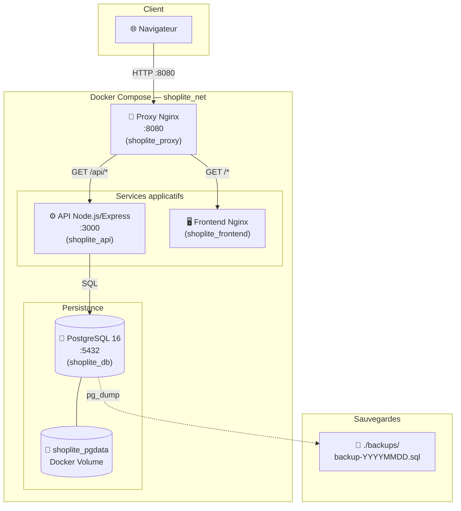
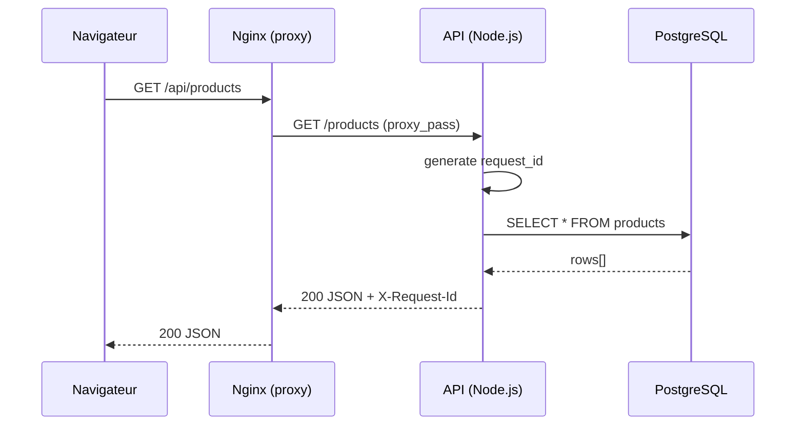
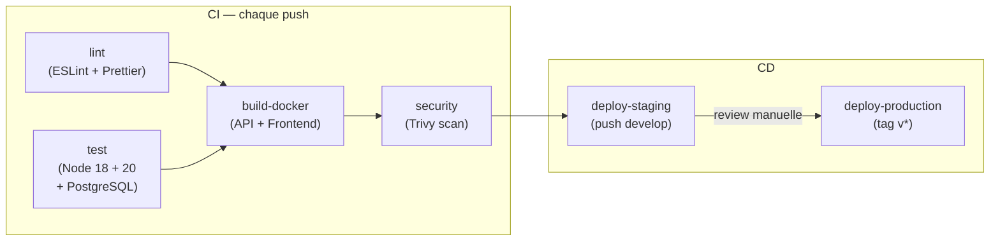
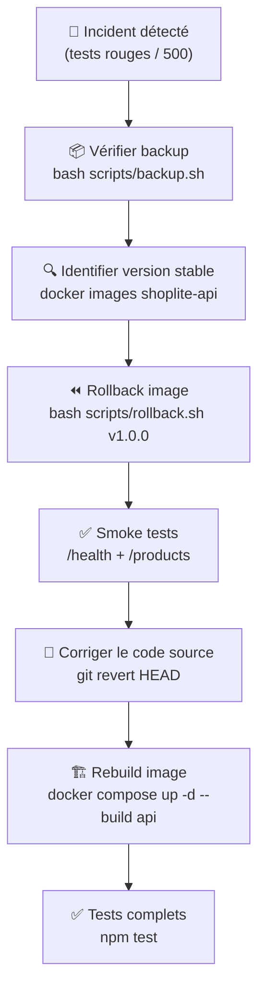

# Architecture — ShopLite

## Vue d'ensemble

ShopLite est une application e-commerce minimaliste composée de 4 services Docker orchestrés par Docker Compose.

---

## Diagramme d'architecture

---

## Flux de requête

---

## Pipeline CI/CD

---

## Flux de rollback

---

## Services Docker

| Service | Image | Port exposé | Rôle |
|---------|-------|-------------|------|
| `shoplite_proxy` | `nginx:1.27-alpine` (custom) | `8080:80` | Reverse proxy, point d'entrée unique |
| `shoplite_api` | `node:20-alpine` (multi-stage) | interne :3000 | API REST Node.js/Express |
| `shoplite_frontend` | `nginx:1.27-alpine` (custom) | interne :80 | Fichiers statiques HTML/CSS/JS |
| `shoplite_db` | `postgres:16-alpine` (custom) | `5432:5432`* | Base de données relationnelle |

*Port exposé en développement uniquement pour les tests Jest locaux.

---

## Choix techniques

| Décision | Choix | Raison |
|----------|-------|--------|
| Runtime API | Node.js 20 LTS | Stabilité + support long terme |
| Base image Docker | Alpine | Image minimale (~50 MB vs ~300 MB Debian) |
| Build multi-stage | deps → runner | Exclut devDependencies et npm cache de l'image finale |
| User non-root | `USER node` | Principe du moindre privilège |
| Sans bind mount | Dockerfiles custom pour db et nginx | Compatibilité Windows (espaces dans les chemins) |
| Logs structurés | JSON sur stdout | Compatible avec tous les agrégateurs de logs (ELK, Loki…) |
| Rollback | Image taguée + `API_VERSION` env var | Rollback instantané sans rebuild |

---

## Variables d'environnement

| Variable | Défaut | Description |
|----------|--------|-------------|
| `POSTGRES_DB` | `shoplite` | Nom de la base de données |
| `POSTGRES_USER` | `shoplite` | Utilisateur PostgreSQL |
| `POSTGRES_PASSWORD` | *(requis)* | Mot de passe PostgreSQL |
| `DATABASE_URL` | — | URL de connexion complète pour l'API |
| `API_PORT` | `3000` | Port d'écoute de l'API |
| `LOG_LEVEL` | `info` | Niveau de log (debug/info/warn/error/fatal) |
| `APP_VERSION` | `1.0.0` | Version affichée dans `/health` |
| `API_VERSION` | `latest` | Tag d'image utilisé au rollback |
| `HTTP_PORT` | `8080` | Port public du proxy Nginx |
